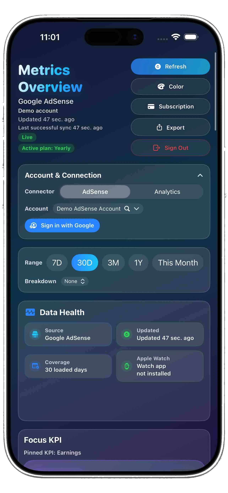

# Metrics Data

Metrics Data is a focused dashboard app for Google AdSense and Google Analytics 4 metrics on iPhone, iPad, Apple Watch, Home Screen widgets, Smart Stack widgets, and complications.

The app is available on the [App Store](https://apps.apple.com/de/app/metrics-data/id6758959570).

Visit the [product site](https://h3pdesign.github.io/Metrics-Data-Public/).

See the complete [h3pdesign portfolio](https://h3pdesign.github.io/) for all work and projects.

## Features

- AdSense and GA4 connector selection
- Dashboard cards for earnings, revenue, RPM, CTR, impressions, clicks, and page views
- Interactive charts with tap-and-drag value inspection
- Focus KPI card and detailed metric views
- Date ranges, breakdowns, account selection, and refresh status
- iPhone, iPad, Apple Watch, Home Screen widgets, Smart Stack widgets, and complications
- Light and dark themes for dashboard and widgets

## Subscription and Demo Mode

Users can explore the dashboard with demo data without connecting a Google account.

A subscription unlocks Google sign-in and live account sync for real AdSense or GA4 account data, including earnings or revenue, RPM, CTR, impressions, clicks, page views, date ranges, and supported breakdowns.

## Privacy

Metrics Data uses Google Sign-In so users can access their own Google-provided AdSense or GA4 data. The app does not provide a standalone account system, social profile login choice, or independent authentication backend.

OAuth tokens and account access must stay in the app's secure storage. This public repository does not contain source code, tokens, StoreKit configuration, signing assets, OAuth secrets, or production credentials.

Use the App Store listing for current privacy details and Apple's standard EULA for terms of use.

Terms of Use: https://www.apple.com/legal/internet-services/itunes/dev/stdeula/

## Support and Contact

For questions about this public product-information repository, open an [issue](https://github.com/h3pdesign/Metrics-Data-Public/issues). The app is supported and distributed through its [App Store listing](https://apps.apple.com/de/app/metrics-data/id6758959570).

App releases are published through the App Store only. This repository does not distribute application binaries or GitHub releases.

## Repository Scope

This is a public product-information repository. It contains selected documentation and visual assets only.

The following are intentionally excluded:

- Application source code
- Xcode projects and build configuration
- Google OAuth secrets and tokens
- StoreKit configuration and signing material
- App binaries and distribution credentials
- Private account, analytics, or customer data

## License

The contents of this repository are proprietary. See [LICENSE](LICENSE). The Metrics Data application is distributed through the App Store and is subject to Apple's terms and the applicable subscription or purchase terms.
